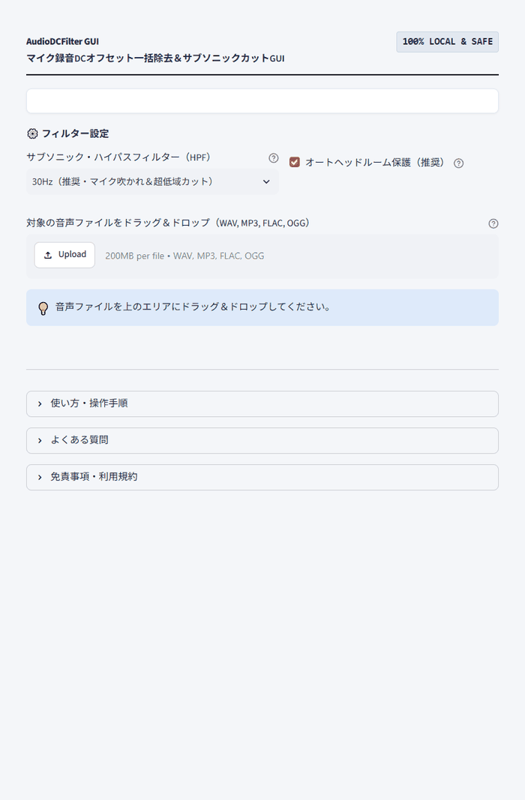

# 【Windows専用】AudioDCFilter GUI ｜ マイク録音DCオフセット一括除去＆サブソニックカットGUI

> **「マイク録音の波形が上下に偏っている……コンプのかかり方が狂う……」**  
> ドラッグ＆ドロップ3秒。音声ファイルを放り込むだけで、直流偏衰（DCオフセット）を物理的に完全消去し、可聴域外の超低域サブソニックノイズを急峻カットするWindows専用ポータブルGUIツールです。

## ■ 操作デモ（実際の動作）

---

## ■ こんな「マイク録音の波形トラブル」、放置していませんか？

- **録音した音声波形を拡大すると、真ん中の基準線（0軸）より上や下に全体がズレている**
- **コンプレッサーをかけると、片側の波形ばかり過剰に潰れてしまい、音が不自然に歪む・音圧が上がらない**
- **マイクの吹かれや空調の床振動（20Hz〜30Hz以下の超低域ノイズ）が混ざって、ヘッドルーム（音量の余裕）を圧迫している**
- **手動でDAWの波形編集を開き、プラグインを1トラックずつ挿して書き出す作業に毎月何時間も奪われている**

マイクやオーディオインターフェースのハードウェア特性によって発生する「DCオフセット（直流漏れ）」は、放置するとミックス作業全体を狂わせる厄介な問題です。  
しかし、**本来の制作作業に集中すべき貴重な時間を、単純な下処理と波形修正に奪われ続ける必要はありません。**

「AudioDCFilter GUI」は、そんな録音・整音現場の悩みをワンクリックで解消するために開発された、完全実務特化型のポータブルソフトウェアです。

---

## ■ なぜ、他の方法ではなく「AudioDCFilter」なのか？（4つの圧倒的理由）

### 1. 信号の平均値減算 ＋ バターワース2次HPFによる「二段完全クレンジング」
波形の直流成分を数学的に平均値減算して物理除去した上で、高精度なバターワース2次ハイパスフィルター（20Hz / 30Hz / 40Hz / OFF）を前進後退ゼロ位相（sosfiltfilt）で適用。  
さらにフィルターの過渡応答による微細オフセットも最終段で再消去するため、**波形は完璧に0基準線の中央へジャストフィット**します。

### 2. 音割れを絶対に起こさない「オートヘッドルーム保護」
フィルター処理による位相変化で瞬間的なピークが0dBFSを超えそうになった場合、自動で安全マージンを確保（微小リダクション）します。  
原音の解像度を100%保ったまま、デジタルクリッピング（音割れ歪み）を確実に防ぎます。

### 3. 案件納品時にクライアントへ提出できる「測定証明CSVレポート」同梱
処理前後のDCオフセット量（%およびdBFS）、Peak、RMSの変化を一覧テーブル化。  
一括ZIPダウンロードの中に `dc_filter_report.csv` が自動同梱されるため、クラウドソーシングや受託編集案件での「プロ品質下処理証明書」としてそのまま提出できます。

### 4. 面倒な環境構築ゼロ。解凍してダブルクリックですぐ起動
Pythonのインストールやコマンドプロンプトの操作は一切不要です。  
配布ZIPを解凍し、専用ランチャーをダブルクリックするだけで直感的な操作画面がスッと立ち上がります。外部通信を一切行わない完全ローカル動作のため、未公開音源や社外秘ナレーションも安全に処理できます。

---

## ■ 使い方（かんたん3ステップ）

1. **起動する**: フォルダ内のランチャー（`START_APP.vbs` または `run.bat`）をダブルクリックします。
2. **放り込む**: 音声ファイル（WAV, MP3, FLAC, OGG）をまとめてドラッグ＆ドロップします。
3. **ボタンを押す**: **「DCオフセット＆超低域カットを実行」** をクリック！
   - 処理前後の数値が一覧表示され、中央軸（0基準線）にきれいに揃った波形プレビューを確認できます。
   - **「📦 補正済みWAV ＆ 納品用レポートを一括ダウンロード（ZIP）」** を押せば、補正済み24bit WAVと証明CSVが即座に入手できます。

---

## ■ 動作環境・仕様

- **対応OS**: Windows 10 / 11 (64-bit)
- **インストール**: 不要（完全スタンドアロン動作・Embedded Python同梱）
- **対応入力フォーマット**: WAV, MP3, FLAC, OGG
- **出力フォーマット**: 24-bit PCM WAV（原音のサンプリング周波数・チャンネル数を完全維持）
- **サブソニックHPF設定**: 30Hz（推奨・マイク吹かれカット）、20Hz（超低域のみカット）、40Hz（強めのサブソニック除去）、OFF（フィルターなし・純粋DC除去のみ）

---

## 🛒 ダウンロード・ご購入のご案内（BOOTH公式ストア）

まずは使い勝手をお手元のPCでお試しいただけるよう、無料Lite版と全機能対応の製品版をご用意しております。

👉 https://nichesoftmakers.booth.pm/
- **無料Lite版**: 0円（まずは基本機能や快適な操作感をお試しいただけます）
- **製品版**: **1,980円**（追加課金なしの買い切り・全機能無制限）

動画編集・音声処理・事務自動化など、全ツールの製品版やおトクな業務別バンドルパックも公式BOOTHストアにて公開中です。

---

## 💡 【ご購入・ご利用前に必ずご確認ください】初回起動時のWindows保護画面について

本ソフトは、パソコンのレジストリを変更せず解凍するだけで手軽に使える「ポータブル仕様（インストール不要）」として提供されているため、初回起動時にWindowsの画面に「**WindowsによってPCが保護されました**」という青い確認画面（SmartScreen）が表示される場合があります。

これは、パソコンのレジストリを変更せず手軽に使える未署名のツールに対して、**Windowsが形式上必ず表示する標準的な安全確認画面**です。  
ウイルス等の不正プログラムは一切含まれておらず、インターネット通信も行わない「完全ローカル・安全設計」となっております。

**【解除・起動手順（2クリックで完了します）】**
1. 画面内の **「詳細情報」** をクリックします。
2. 右下に現れる **「実行」** ボタンをクリックします。  
※一度実行すれば、次回以降はこの画面は表示されずスムーズに起動します。

---

## 📄 免責事項・利用規約（ライセンス区分）

- **個人利用を想定**: 本ソフトウェアは個人クリエイター・個人事業主等のPC業務効率化を目的として開発された個人利用専用ツールです。
- **シングルユーザー許諾**: ご購入者様本人（1名）のみ利用可能（ご自身が専属で使用する複数台PCでの利用は許可されます）。組織内での共有・複数名での共同利用・社内共有には対応しておりません。
- 本ソフトウェアは現状有姿（As-Is）で提供され、技術サポート・個別動作保証は行われません。詳細は同梱の `README.txt`（または `README_免責事項.txt`）をご確認ください。
